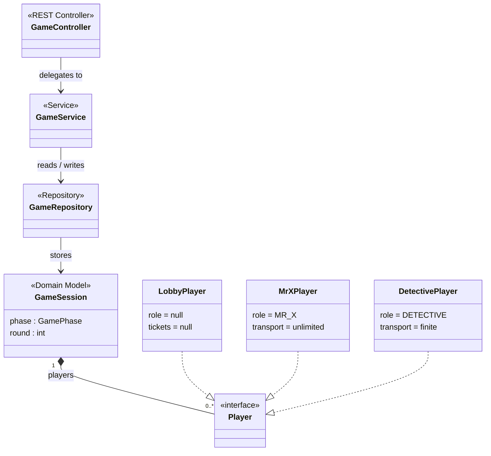

# Backend Class Diagrams

## High-Level Overview



## Detailed Diagram

```mermaid
classDiagram

```mermaid
classDiagram
    %% ── Enums ──────────────────────────────────────────────────────────────

    class GamePhase {
        <<enumeration>>
        LOBBY
        IN_PROGRESS
        PAUSED
        ENDED
    }

    class TurnPhase {
        <<enumeration>>
        MR_X_TURN
        DETECTIVE_TURN
    }

    class Role {
        <<enumeration>>
        MR_X
        DETECTIVE
    }

    class TicketType {
        <<enumeration>>
        ESCOOTER
        BUS
        TRAIN
        FERRY
        BLACK
        DOUBLE
    }

    %% ── Player hierarchy ───────────────────────────────────────────────────

    class Player {
        <<interface>>
        +getId() String
        +getName() String
        +getRole() Role
        +getNodeId() Integer
        +setNodeId(Integer)
        +getTickets() Map~TicketType, Integer~
        +getTicket(TicketType) Integer
        +useTicket(TicketType)
    }

    class LobbyPlayer {
        -String id
        -String name
        -Integer nodeId
        +LobbyPlayer(String id, String name)
        +getRole() Role
        +getTickets() Map~TicketType, Integer~
        +getTicket(TicketType) Integer
        +useTicket(TicketType)
    }

    class MrXPlayer {
        -String id
        -String name
        -Integer nodeId
        -Map~TicketType, Integer~ tickets
        +MrXPlayer(String id, String name, int detectiveCount)
        +getRole() Role
        +getTickets() Map~TicketType, Integer~
        +getTicket(TicketType) Integer
        +useTicket(TicketType)
    }

    class DetectivePlayer {
        -String id
        -String name
        -Integer nodeId
        -Map~TicketType, Integer~ tickets
        +DetectivePlayer(String id, String name, int escooter, int bus, int train, int ferry)
        +getRole() Role
        +getTickets() Map~TicketType, Integer~
        +getTicket(TicketType) Integer
        +useTicket(TicketType)
    }

    LobbyPlayer  ..|> Player
    MrXPlayer    ..|> Player
    DetectivePlayer ..|> Player

    %% ── Domain model ───────────────────────────────────────────────────────

    class GameSession {
        -String id
        -String joinCode
        -GamePhase phase
        -int maxPlayers
        -String hostPlayerId
        -List~Player~ players
        -int round
        -TurnPhase turnPhase
        -String currentPlayerId
        -String winner
        -String abortReason
    }

    GameSession "1" *-- "0..*" Player : players
    GameSession --> GamePhase
    GameSession --> TurnPhase

    %% ── DTOs ───────────────────────────────────────────────────────────────

    class GameStateDTO {
        -String gameId
        -String joinCode
        -GamePhase phase
        -int maxPlayers
        -int round
        -TurnPhase turnPhase
        -String currentPlayerId
        -String winner
        -String abortReason
        -List~PlayerDTO~ players
    }

    class PlayerDTO {
        -String id
        -String name
        -Role role
        -Integer nodeId
        -Map~TicketType, Integer~ tickets
    }

    class CreateGameRequest {
        -String hostName
        -int maxPlayers
    }

    class JoinGameRequest {
        -String joinCode
        -String playerName
    }

    class StartGameRequest {
        -String playerId
    }

    class KickPlayerRequest {
        -String hostId
    }

    GameStateDTO "1" *-- "0..*" PlayerDTO : players

    %% ── Repository ─────────────────────────────────────────────────────────

    class GameRepository {
        -ConcurrentHashMap~String, GameSession~ store
        +save(GameSession) GameSession
        +findById(String) Optional~GameSession~
        +findByJoinCode(String) Optional~GameSession~
        +delete(String)
    }

    GameRepository --> GameSession

    %% ── Service ─────────────────────────────────────────────────────────────

    class GameService {
        -int escooterTickets
        -int busTickets
        -int trainTickets
        -int ferryTickets
        +createGame(String hostName, int maxPlayers) CreateResult
        +joinGame(String joinCode, String playerName) JoinResult
        +getGame(String gameId) GameStateDTO
        +startGame(String gameId, String playerId) GameStateDTO
        +leaveGame(String gameId, String playerId)
        +kickPlayer(String gameId, String hostId, String targetPlayerId)
    }

    GameService --> GameRepository
    GameService --> GameStateDTO
    GameService --> LobbyPlayer
    GameService --> MrXPlayer
    GameService --> DetectivePlayer

    %% ── Controller ─────────────────────────────────────────────────────────

    class GameController {
        +POST /api/games createGame(CreateGameRequest)
        +POST /api/games/join joinGame(JoinGameRequest)
        +GET /api/games/:id getGame(String id)
        +POST /api/games/:id/start startGame(String id, StartGameRequest)
        +DELETE /api/games/:id/players/:playerId leaveGame(String id, String playerId)
        +POST /api/games/:id/players/:targetId/kick kickPlayer(String id, String targetId, KickPlayerRequest)
    }

    GameController --> GameService
    GameController ..> CreateGameRequest
    GameController ..> JoinGameRequest
    GameController ..> StartGameRequest
    GameController ..> KickPlayerRequest
```
