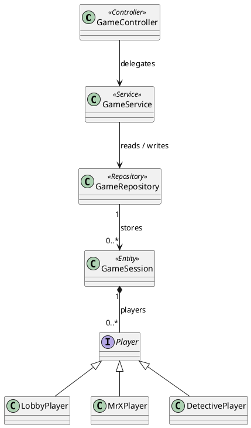
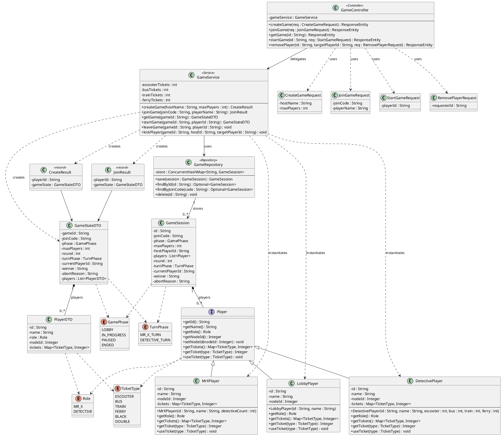

# Backend Class Diagrams

## High-Level Overview

```plantuml
@startuml

skinparam classAttributeIconSize 0

class GameController <<Controller>>
class GameService <<Service>>
class GameRepository <<Repository>>
class GameSession <<Entity>>
interface Player
class LobbyPlayer
class MrXPlayer
class DetectivePlayer

GameController --> GameService : delegates
GameService  --> GameRepository : reads / writes
GameRepository "1" --> "0..*" GameSession : stores
GameSession "1" *-- "0..*" Player : players

Player <|-- LobbyPlayer
Player <|-- MrXPlayer
Player <|-- DetectivePlayer

@enduml
```

## Detailed Diagram

```plantuml
@startuml

skinparam classAttributeIconSize 0

' ── Enumerations ──────────────────────────────────────────────────────

enum GamePhase {
    LOBBY
    IN_PROGRESS
    PAUSED
    ENDED
}

enum TurnPhase {
    MR_X_TURN
    DETECTIVE_TURN
}

enum Role {
    MR_X
    DETECTIVE
}

enum TicketType {
    ESCOOTER
    BUS
    TRAIN
    FERRY
    BLACK
    DOUBLE
}

' ── Player hierarchy ──────────────────────────────────────────────────

interface Player {
    + getId() : String
    + getName() : String
    + getRole() : Role
    + getNodeId() : Integer
    + setNodeId(nodeId : Integer) : void
    + getTickets() : Map<TicketType, Integer>
    + getTicket(type : TicketType) : Integer
    + useTicket(type : TicketType) : void
}

class LobbyPlayer {
    - id : String
    - name : String
    - nodeId : Integer
    --
    + LobbyPlayer(id : String, name : String)
    + getRole() : Role
    + getTickets() : Map<TicketType, Integer>
    + getTicket(type : TicketType) : Integer
    + useTicket(type : TicketType) : void
}

class MrXPlayer {
    - id : String
    - name : String
    - nodeId : Integer
    - tickets : Map<TicketType, Integer>
    --
    + MrXPlayer(id : String, name : String, detectiveCount : int)
    + getRole() : Role
    + getTickets() : Map<TicketType, Integer>
    + getTicket(type : TicketType) : Integer
    + useTicket(type : TicketType) : void
}

class DetectivePlayer {
    - id : String
    - name : String
    - nodeId : Integer
    - tickets : Map<TicketType, Integer>
    --
    + DetectivePlayer(id : String, name : String, escooter : int, bus : int, train : int, ferry : int)
    + getRole() : Role
    + getTickets() : Map<TicketType, Integer>
    + getTicket(type : TicketType) : Integer
    + useTicket(type : TicketType) : void
}

Player <|-- LobbyPlayer
Player <|-- MrXPlayer
Player <|-- DetectivePlayer
Player ..> Role
Player ..> TicketType

' ── Domain model ──────────────────────────────────────────────────────

class GameSession {
    - id : String
    - joinCode : String
    - phase : GamePhase
    - maxPlayers : int
    - hostPlayerId : String
    - players : List<Player>
    - round : int
    - turnPhase : TurnPhase
    - currentPlayerId : String
    - winner : String
    - abortReason : String
}

GameSession "1" *-- "0..*" Player : players
GameSession ..> GamePhase
GameSession ..> TurnPhase

' ── DTOs ──────────────────────────────────────────────────────────────

class GameStateDTO {
    - gameId : String
    - joinCode : String
    - phase : GamePhase
    - maxPlayers : int
    - round : int
    - turnPhase : TurnPhase
    - currentPlayerId : String
    - winner : String
    - abortReason : String
    - players : List<PlayerDTO>
}

class PlayerDTO {
    - id : String
    - name : String
    - role : Role
    - nodeId : Integer
    - tickets : Map<TicketType, Integer>
}

class CreateGameRequest {
    - hostName : String
    - maxPlayers : int
}

class JoinGameRequest {
    - joinCode : String
    - playerName : String
}

class StartGameRequest {
    - playerId : String
}

class RemovePlayerRequest {
    - requesterId : String
}

class CreateResult <<record>> {
    - playerId : String
    - gameState : GameStateDTO
}

class JoinResult <<record>> {
    - playerId : String
    - gameState : GameStateDTO
}

GameStateDTO "1" *-- "0..*" PlayerDTO : players
GameStateDTO ..> GamePhase
GameStateDTO ..> TurnPhase
PlayerDTO ..> Role
PlayerDTO ..> TicketType
CreateResult --> GameStateDTO
JoinResult  --> GameStateDTO

' ── Repository ────────────────────────────────────────────────────────

class GameRepository <<Repository>> {
    - store : ConcurrentHashMap<String, GameSession>
    --
    + save(session : GameSession) : GameSession
    + findById(id : String) : Optional<GameSession>
    + findByJoinCode(code : String) : Optional<GameSession>
    + delete(id : String) : void
}

GameRepository "1" --> "0..*" GameSession : stores

' ── Service ───────────────────────────────────────────────────────────

class GameService <<Service>> {
    - escooterTickets : int
    - busTickets : int
    - trainTickets : int
    - ferryTickets : int
    --
    + createGame(hostName : String, maxPlayers : int) : CreateResult
    + joinGame(joinCode : String, playerName : String) : JoinResult
    + getGame(gameId : String) : GameStateDTO
    + startGame(gameId : String, playerId : String) : GameStateDTO
    + leaveGame(gameId : String, playerId : String) : void
    + kickPlayer(gameId : String, hostId : String, targetPlayerId : String) : void
}

GameService --> GameRepository : uses
GameService ..> GameStateDTO : creates
GameService ..> CreateResult : creates
GameService ..> JoinResult : creates
GameService ..> LobbyPlayer : instantiates
GameService ..> MrXPlayer : instantiates
GameService ..> DetectivePlayer : instantiates

' ── Controller ────────────────────────────────────────────────────────

class GameController <<Controller>> {
    - gameService : GameService
    --
    + createGame(req : CreateGameRequest) : ResponseEntity
    + joinGame(req : JoinGameRequest) : ResponseEntity
    + getGame(id : String) : ResponseEntity
    + startGame(id : String, req : StartGameRequest) : ResponseEntity
    + removePlayer(id : String, targetPlayerId : String, req : RemovePlayerRequest) : ResponseEntity
}

GameController --> GameService : delegates
GameController ..> CreateGameRequest : uses
GameController ..> JoinGameRequest : uses
GameController ..> StartGameRequest : uses
GameController ..> RemovePlayerRequest : uses

@enduml
```
