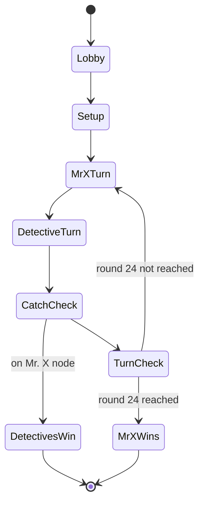
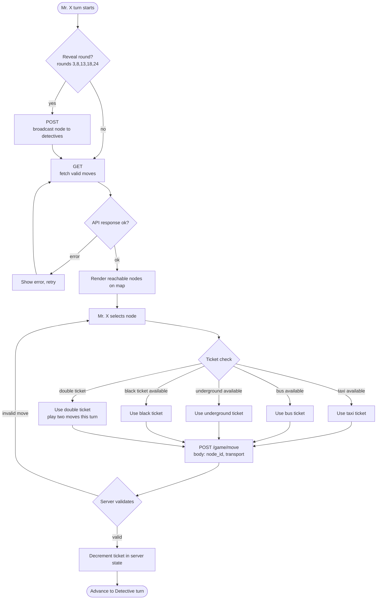
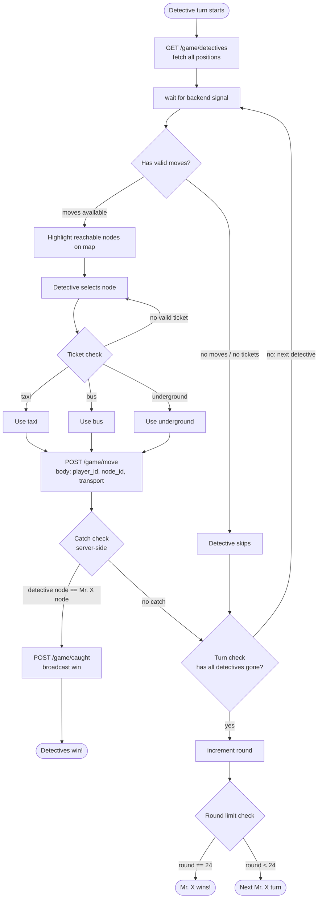

### Overall High level states

``` mermaid
stateDiagram-v2
    direction TB

    [*] --> Lobby
    Lobby --> Setup
    Setup --> MrXTurn

	MrXTurn --> DetectiveTurn
	DetectiveTurn --> CatchCheck
	
	CatchCheck --> DetectivesWin : on Mr. X node
	CatchCheck --> TurnCheck
    
    TurnCheck --> MrXWins : round 24 reached
    TurnCheck --> MrXTurn : round 24 not reached
	
    DetectivesWin --> [*]
    MrXWins --> [*]
```

---

### Mr X states

``` mermaid
flowchart TD
    A([Mr. X turn starts]) --> R{Reveal round?\nrounds 3,8,13,18,24}
    R -- yes --> RA[POST\nbroadcast node to detectives]
    R -- no --> B
    RA --> B[GET \nfetch valid moves]
    B --> C{API response ok?}
    C -- error --> B2[Show error, retry]
    B2 --> B
    C -- ok --> D[Render reachable nodes on map]
    D --> E[Mr. X selects node]
    E --> F{Ticket check}
    F -- taxi available --> G1[Use taxi ticket]
    F -- bus available --> G2[Use bus ticket]
    F -- underground available --> G3[Use underground ticket]
    F -- black ticket available --> G4[Use black ticket]
    F -- double ticket --> G5[Use double ticket\nplay two moves this turn]
    G1 & G2 & G3 & G4 & G5 --> I[POST /game/move\nbody: node_id, transport]
    I --> J{Server validates}
    J -- invalid move --> E
    J -- valid --> N[Decrement ticket in server state]
    N --> O([Advance to Detective turn])

```

---

### Detective states

``` mermaid
flowchart TD
    A([Detective turn starts]) --> A1[GET /game/detectives\nfetch all positions]
    A1 --> B[wait for backend signal]
    B --> D{Has valid moves?}
    D -- no moves / no tickets --> E[Detective skips]
    D -- moves available --> F[Highlight reachable nodes on map]
    F --> G[Detective selects node]
    G --> H{Ticket check}
    H -- taxi --> I1[Use taxi]
    H -- bus --> I2[Use bus]
    H -- underground --> I3[Use underground]
    H -- no valid ticket --> G
    I1 & I2 & I3 --> J[POST /game/move\nbody: player_id, node_id, transport]
    J --> K{Catch check\nserver-side}
    K -- detective node == Mr. X node --> L[POST /game/caught\nbroadcast win]
    L --> M([Detectives win!])
    K -- no catch --> N{Turn check\nhas all detectives gone?}
    E --> N
    N -- no: next detective --> B
    N -- yes --> O[increment round]
    O --> P{Round limit check}
    P -- round == 24 --> Q([Mr. X wins!])
    P -- round < 24 --> R([Next Mr. X turn])
  
```

---

### Backend flow chart

```mermaid
stateDiagram-v2
    direction TB

    [*] --> Idle

    Idle --> Initialising : start game request received

    state Initialising {
        [*] --> CreatingGame
        CreatingGame --> DealingTickets : instantiate Lobby object
        DealingTickets --> AssigningPositions : "set Mr. X black=5 double=2<br/>detective ticket counts in Player objects"
        AssigningPositions --> BroadcastingStart : set starting positions in Player objects
        BroadcastingStart --> [*] : WS broadcast GAME_STARTED
    }

    Initialising --> RoundStart : "initialisation complete, round = 1"

    state RoundStart {
        [*] --> CheckReveal
        CheckReveal --> BroadcastReveal : round in 3,8,13,18,24
        CheckReveal --> [*] : hidden round, skip
        BroadcastReveal --> [*] : "read mrX.position from Lobby<br/>WS broadcast MRX_REVEALED"
    }

    RoundStart --> AwaitingMrXMove : reveal check done

    state AwaitingMrXMove {
        [*] --> ComputingValidMoves
        ComputingValidMoves --> ReadyForInput : "traverse adjacency graph<br/>no ticket constraint for taxi, bus, ug"
        ReadyForInput --> ValidatingMove : move request received
        ValidatingMove --> ValidatingMove : node not in validMoves, reject
        ValidatingMove --> ApplyingMove : node reachable, accept

        state ApplyingMove {
            [*] --> CheckingTicketType
            CheckingTicketType --> DecrementBlack : transport == BLACK
            CheckingTicketType --> DecrementDouble : transport == DOUBLE
            CheckingTicketType --> UpdatePosition : "transport == TAXI, BUS or UG<br/>no change to ticket fields"
            DecrementBlack --> UpdatePosition : mrX.blackTickets--
            DecrementDouble --> UpdatePosition : "mrX.doubleTickets--<br/>set doubleMovePending = true"
            UpdatePosition --> [*] : mrX.position = destNode
        }

        ApplyingMove --> BroadcastingTransport : move applied
        BroadcastingTransport --> [*] : "WS broadcast TRANSPORT_USED<br/>position withheld from detectives"
    }

    AwaitingMrXMove --> DoubleMovePending : doubleMovePending == true
    DoubleMovePending --> AwaitingMrXMove : "second move, set doubleMovePending = false"

    AwaitingMrXMove --> AwaitingDetectiveMoves : single move complete

    state AwaitingDetectiveMoves {
        [*] --> NextDetective
        NextDetective --> ComputingDetMoves : "traverse adjacency graph<br/>filter by detective ticket counts"
        ComputingDetMoves --> DetReadyForInput : validMoves list returned
        ComputingDetMoves --> DetSkipped : "validMoves empty<br/>set detective.skipped = true"
        DetReadyForInput --> ValidatingDetMove : move request received
        ValidatingDetMove --> ValidatingDetMove : node not in validMoves, reject
        ValidatingDetMove --> ApplyingDetMove : valid, accept
        ApplyingDetMove --> DecrementDetTicket : detective.position = destNode
        DecrementDetTicket --> RunningCatchCheck : detective.tickets[transport]--

        state RunningCatchCheck {
            [*] --> ComparingNodes
            ComparingNodes --> CatchConfirmed : detective.position == mrX.position
            ComparingNodes --> NoCatch : positions differ
        }

        RunningCatchCheck --> BroadcastDetMove : "no catch<br/>WS broadcast detective moved"
        BroadcastDetMove --> DetSkipped
        DetSkipped --> NextDetective : detectives iterator has next
        DetSkipped --> [*] : all detectives done
        RunningCatchCheck --> DetectivesWin : catch confirmed
    }

    AwaitingDetectiveMoves --> DetectivesWin : catch confirmed mid-turn
    AwaitingDetectiveMoves --> RoundEnd : all detectives moved

    state RoundEnd {
        [*] --> IncrementingRound
        IncrementingRound --> CheckingRoundLimit : lobby.round++
        CheckingRoundLimit --> MrXWins : round > 24
        CheckingRoundLimit --> [*] : round <= 24, continue
    }

    RoundEnd --> MrXWins : round limit reached
    RoundEnd --> RoundStart : next round begins

    state DetectivesWin {
        [*] --> BroadcastingDetWin
        BroadcastingDetWin --> [*] : "set lobby.result = DETECTIVES_WIN<br/>WS broadcast DETECTIVES_WIN"
    }

    state MrXWins {
        [*] --> BroadcastingMrXWin
        BroadcastingMrXWin --> [*] : "set lobby.result = MRX_WINS<br/>WS broadcast MRX_WINS"
    }

    DetectivesWin --> LobbyOver
    MrXWins --> LobbyOver

    state LobbyOver {
        [*] --> CleaningUp
        CleaningUp --> [*] : "close WS sessions<br/>nullify Lobby object"
    }

    LobbyOver --> [*]
```

