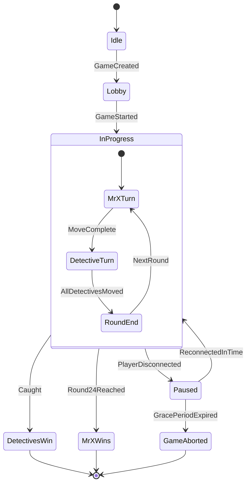
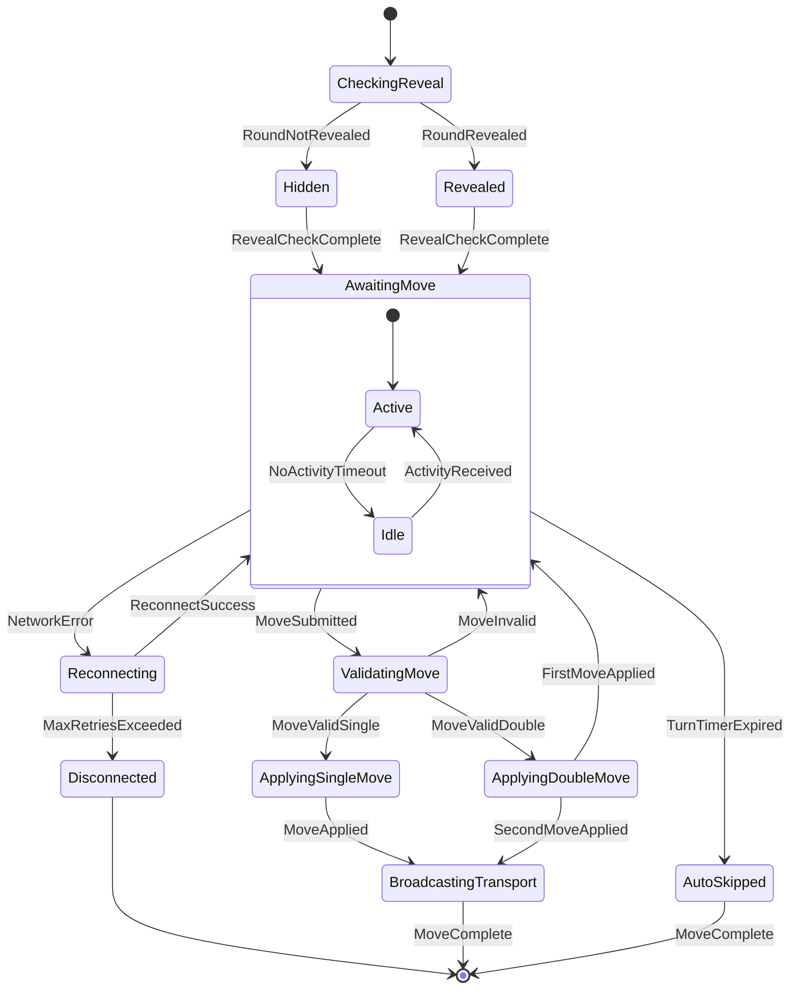
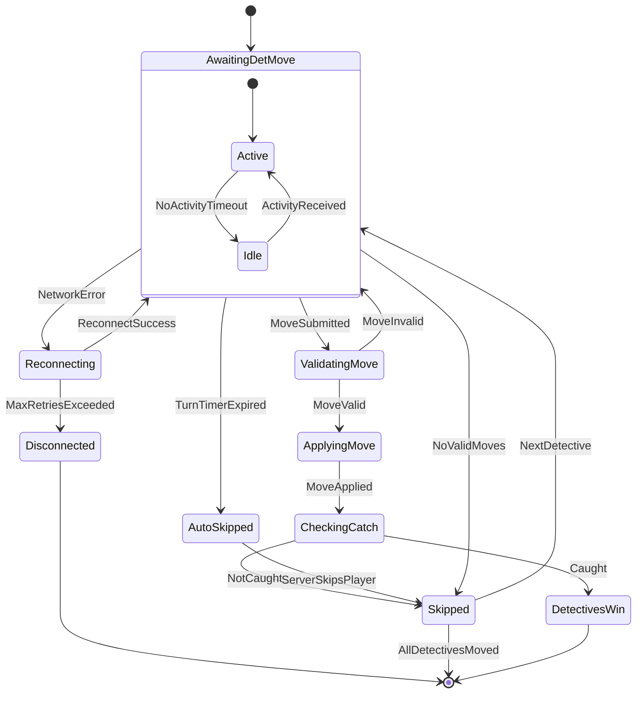

### Overview

Game-level phases with disconnection handling. A player going missing pauses the game in **Paused**; if they reconnect in time play resumes, otherwise the game aborts.

---

### Mr X states

**AwaitingMove** tracks whether Mr X is actively engaged or idle. A turn timer expiry auto-skips the move server-side. Network errors enter a reconnection loop before either resuming or disconnecting.

---

### Detective states

Same active/idle tracking and error paths as Mr X. **AutoSkipped** feeds into the normal **Skipped** path so the turn-rotation logic stays consistent regardless of how a detective's turn ended.

