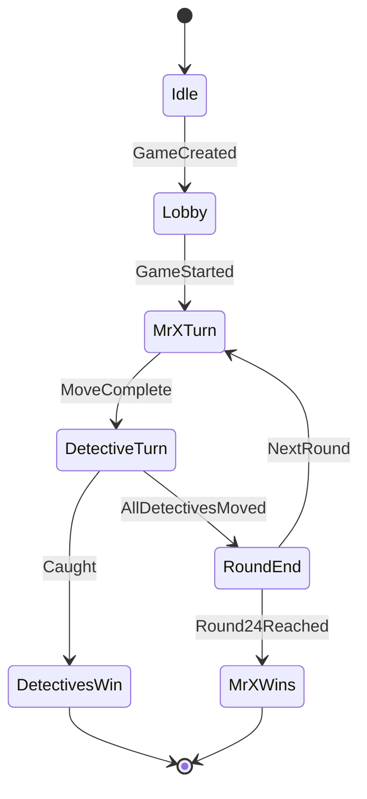
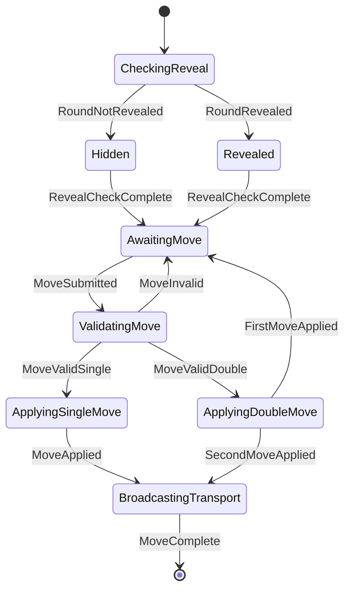
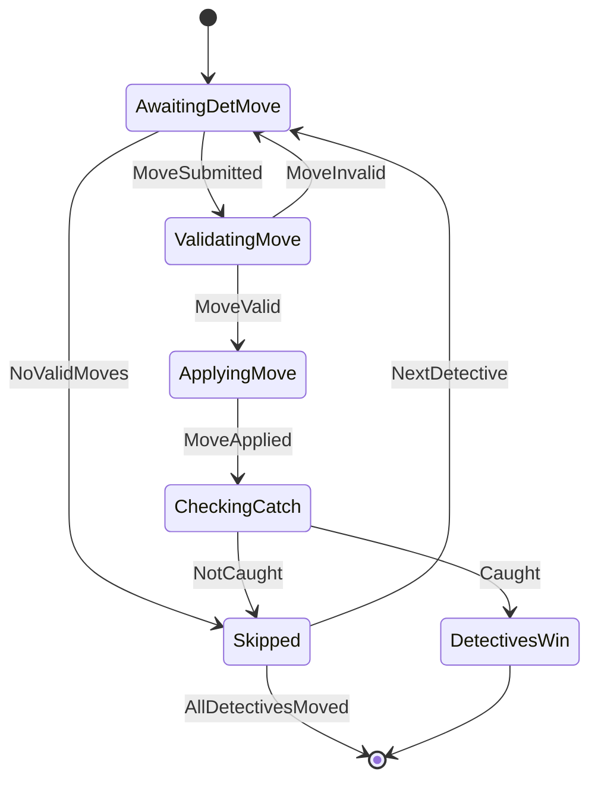
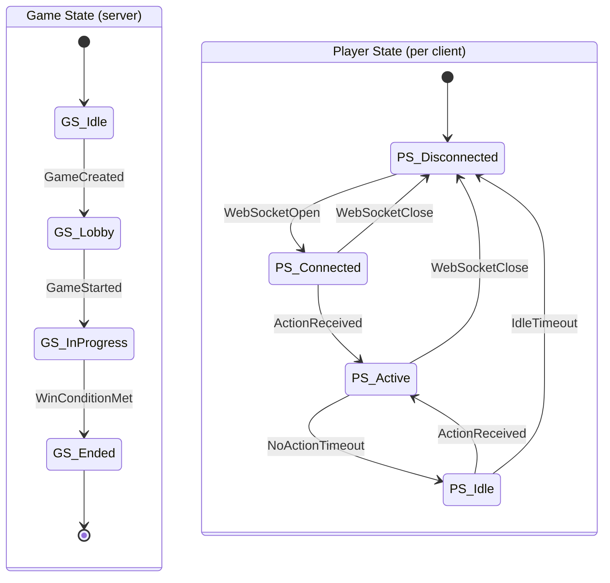
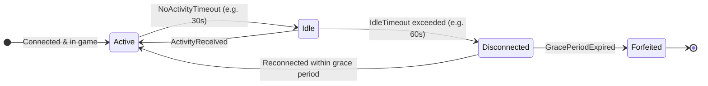
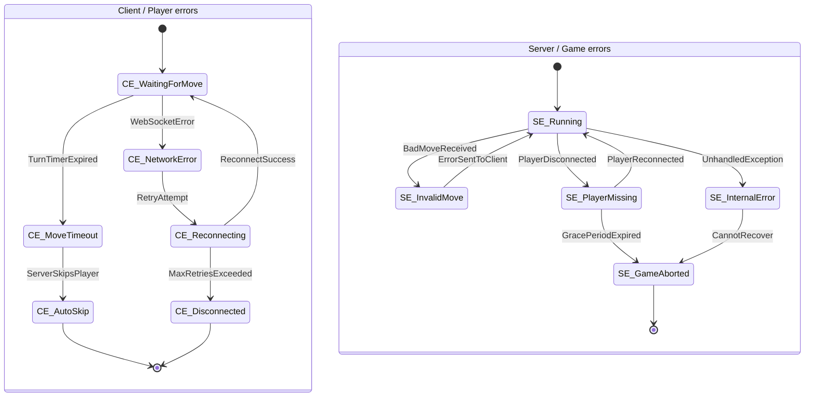

### Overview

---

### Mr x states

---

### Detective states

---

### Game state vs Player state

The **game state** is server-authoritative and drives phase transitions (whose turn it is, round number, win conditions). The **player state** is per-connection and tracks whether a client is actively interacting or has gone quiet — a distinction that matters for timeout handling and reconnection logic.

---

### Player active vs idle

A player transitions to **Idle** after a period of inactivity (no moves, heartbeats, or messages). If idleness persists past a second threshold the server treats the player as disconnected and may pause or forfeit accordingly.

---

### Timeouts and errors

Key failure modes and where they surface — client-side errors belong in player state; server-side errors belong in game state.

