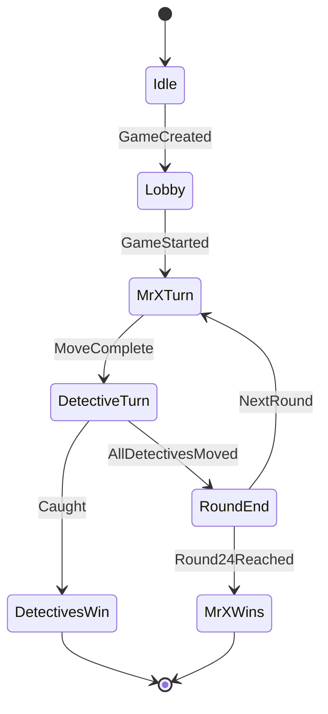
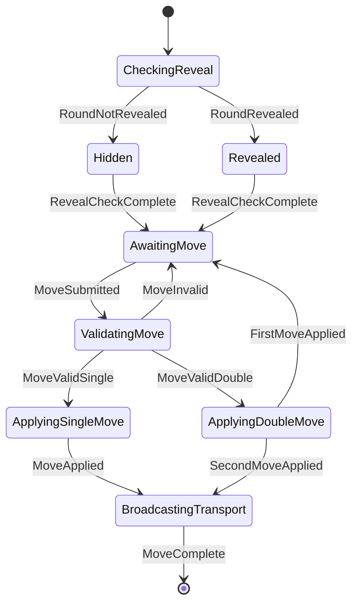
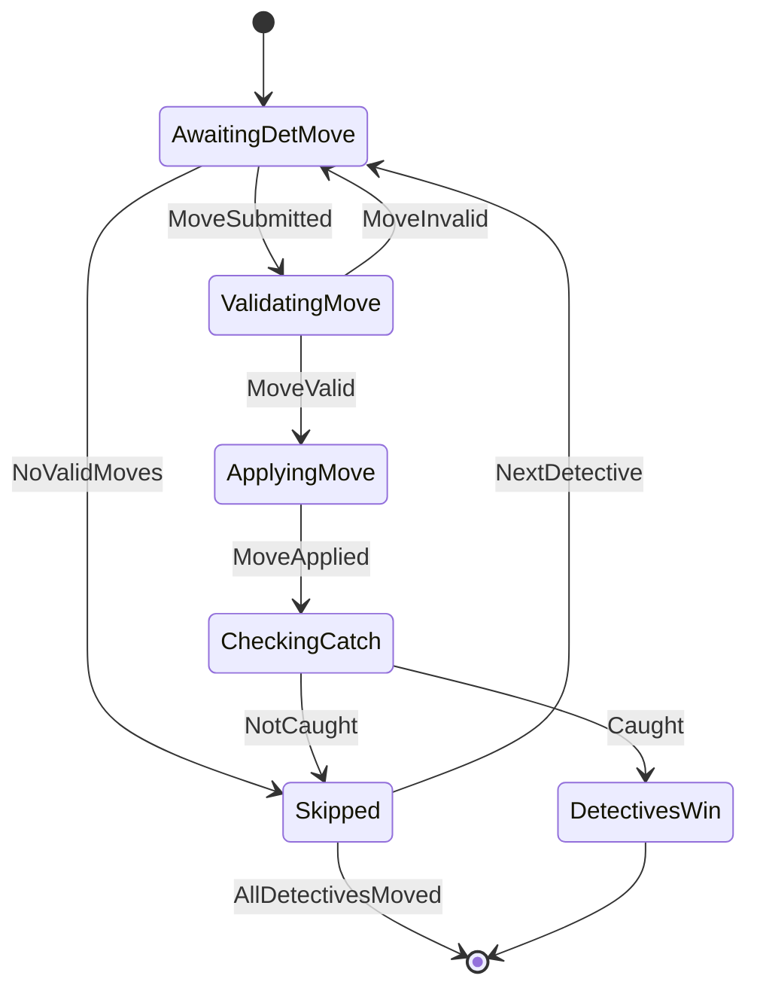

### Overview

```mermaid
stateDiagram-v2
    direction TB

    [*] --> Idle
    Idle --> Lobby : GameCreated
    Lobby --> MrXTurn : GameStarted
    MrXTurn --> DetectiveTurn : MoveComplete
    DetectiveTurn --> RoundEnd : AllDetectivesMoved
    DetectiveTurn --> DetectivesWin : Caught
    RoundEnd --> MrXTurn : NextRound
    RoundEnd --> MrXWins : Round24Reached
    DetectivesWin --> [*]
    MrXWins --> [*]
```

---

### Mr x states

```mermaid
stateDiagram
    direction TB

    [*] --> CheckingReveal
    CheckingReveal --> Hidden : RoundNotRevealed
    CheckingReveal --> Revealed : RoundRevealed
    Hidden --> AwaitingMove : RevealCheckComplete
    Revealed --> AwaitingMove : RevealCheckComplete
    AwaitingMove --> ValidatingMove : MoveSubmitted
    ValidatingMove --> AwaitingMove : MoveInvalid
    ValidatingMove --> ApplyingSingleMove : MoveValidSingle
    ValidatingMove --> ApplyingDoubleMove : MoveValidDouble
    ApplyingSingleMove --> BroadcastingTransport : MoveApplied
    ApplyingDoubleMove --> AwaitingMove : FirstMoveApplied
    ApplyingDoubleMove --> BroadcastingTransport : SecondMoveApplied
    BroadcastingTransport --> [*] : MoveComplete
```

---

### Detective states

```mermaid
stateDiagram
    direction TB

    [*] --> AwaitingDetMove
    AwaitingDetMove --> ValidatingMove : MoveSubmitted
    AwaitingDetMove --> Skipped : NoValidMoves
    ValidatingMove --> AwaitingDetMove : MoveInvalid
    ValidatingMove --> ApplyingMove : MoveValid
    ApplyingMove --> CheckingCatch : MoveApplied
    CheckingCatch --> DetectivesWin : Caught
    CheckingCatch --> Skipped : NotCaught
    Skipped --> AwaitingDetMove : NextDetective
    Skipped --> [*] : AllDetectivesMoved
    DetectivesWin --> [*]
```

